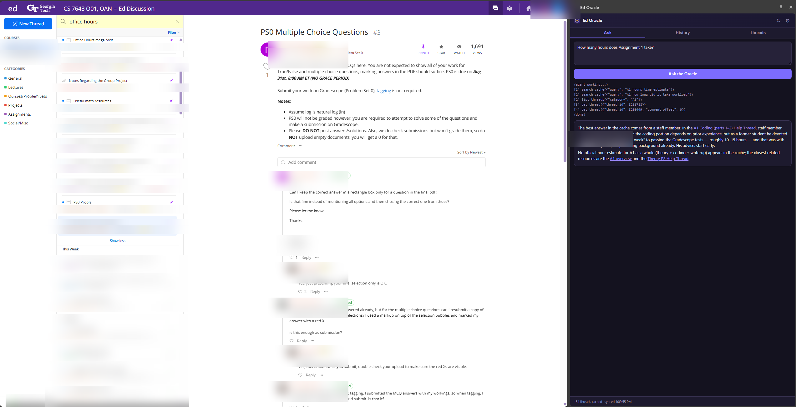
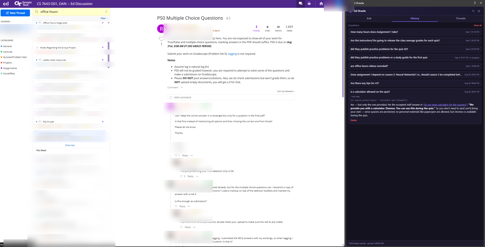

# Ed Oracle — Chrome Extension

LLM-powered oracle over your course's Ed Discussion board, living in your
browser. It auto-syncs the Ed board into a local cache (IndexedDB), and an LLM
agent searches/reads the cache itself to answer questions with citations.
Everything is configured in a settings UI — no code editing.

## Why not just use Ed's search?

Ed's built-in search is **keyword matching, not semantics**. It finds exact-ish
word overlaps, so it misses:

- **Different vocabulary** — you'd search *"people didn't come to our project
  meeting"* and never find the thread where a TA discussed **attendance** or
  **no-show teammates**. The oracle's agent translates your question into
  multiple keyword queries, tries alternative phrasings the way other students
  would have written them, and iterates when results miss.
- **Answers buried in the wrong place** — the answer to *"is a calculator
  allowed on the quiz?"* often lives in a comment on an unrelated megathread,
  not the thread whose title matches. The oracle searches across **every post,
  accepted answer, endorsed answer and comment**, then reads promising threads
  in full and weighs staff/accepted answers most heavily.
- **Follow-the-thread questions** — *"did the policy change since last week?"*
  requires reading a megathread chronologically and comparing dates. Ed's
  search can't do that; the agent can, paging through long threads with
  permalinks back to the exact comment.

In short: Ed search gives you a list of titles containing your keywords. The
oracle answers the question, cites the exact posts it drew from, and tells you
plainly when the board doesn't contain the answer.

## Install (unpacked)

1. Open `chrome://extensions`
2. Enable **Developer mode** (top right)
3. **Load unpacked** → select the `ed-oracle-extension/` folder

## Configure

1. Click the Ed Oracle icon → gear icon (or right-click → Options)
2. **LLM endpoint**: any OpenAI-compatible base URL + API key + model.
   Examples:
   - OpenAI: `https://api.openai.com/v1`, model `gpt-4o-mini`
   - DeepInfra: `https://api.deepinfra.com/v1/openai`, model `zai-org/GLM-5.3-Flash`
   - OpenRouter: `https://openrouter.ai/api/v1`
   - Ollama (local): `http://localhost:11434/v1` (key can be anything)
3. **Ed course ID**: the number in `edstem.org/us/courses/<ID>/discussion`
4. Save. When prompted, allow the permission for your endpoint's origin
   (needed if the endpoint doesn't send CORS headers).

## Ed token — fully automatic

The CLI version needed manual JWT copy/paste every ~2 weeks. The extension grabs
the token itself:

- A content script runs whenever you open **edstem.org** while logged in and
  reads the session JWT from `localStorage` — that's it.
- As a fallback it also checks for a JWT-looking session cookie.
- The background worker tries Ed's `renew_token` endpoint when the stored token
  is within 3 days of expiry.

You can also paste a token manually in Settings as an override.

## Popup & side panel

Clicking the toolbar icon opens the oracle as a **docked side panel** (Chrome
114+): it stays open while you click around the Ed page, so you can type half a
question, go read a thread, and come back without anything disappearing. The
popup (same UI) remains as a fallback for older browsers. Both share one
codebase — `popup.html` detects `?view=side` and switches to a fill-height
layout. Belt-and-suspenders: the half-typed question is also saved as you type
and restored when the panel/popup reopens (cleared once the ask succeeds).

- **Ask** — ask anything; the agent searches the cache (2–12 tool calls),
  streams its progress, and answers with inline Ed permalinks.
- **History** — every past question with its full answer, tool-call trace,
  timestamps. Click to expand, delete individually or clear all.
- **Threads** — full-text search over the cached board (posts, answers,
  comments) with accepted/staff/unanswered badges; hits deep-link to the exact
  Ed comment.

## Background sync

On install (and then on a schedule, default every 120 min, configurable) the
service worker syncs the course board into IndexedDB, same logic as the CLI:

- Paged fetch of the activity-sorted thread list
- Detail re-fetch only for threads whose `updated_at` / reply count changed
- Threads removed from Ed are marked deleted

## Files

- `manifest.json` — MV3 manifest (permissions: storage, alarms, cookies; host
  access to `edstem.org`; optional host access for your LLM endpoint)
- `content.js` — auto-token grabber on edstem.org pages
- `background.js` — service worker: token capture/renewal + scheduled sync
- `lib/db.js` — IndexedDB cache + BM25-ish search (port of `db.py`)
- `lib/ed.js` — Ed API client (port of `ed_client.py`)
- `lib/agent.js` — agentic LLM loop with `search_cache` / `get_thread` /
  `list_threads` tools (port of `agent.py` + `oracle.py ask`)
- `popup.html/css/js` — the popup UI
- `options.html/js` — settings page

## Notes

- Private/anonymous posts you can see in Ed are cached locally on your machine
  only; nothing is sent anywhere except your configured LLM endpoint.
- The first sync fetches every thread's details and can take a minute or two
  for large courses. Subsequent syncs are incremental.
